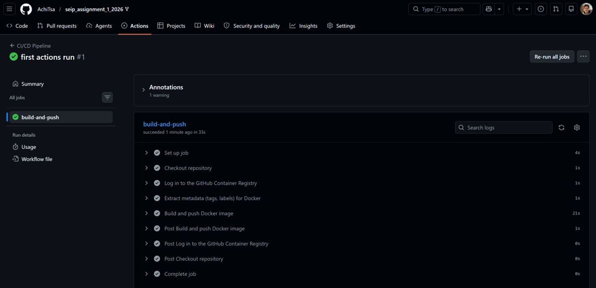
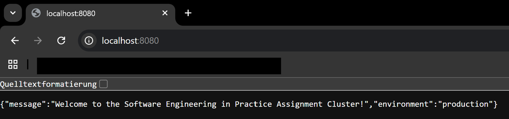
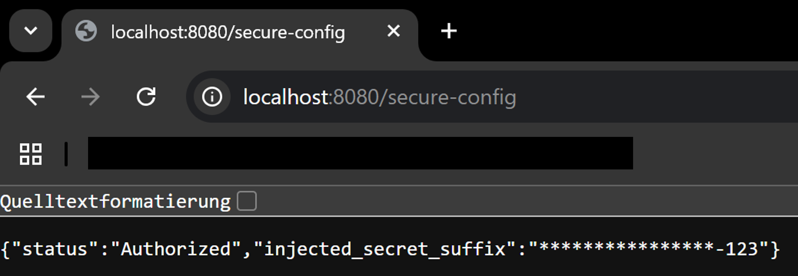
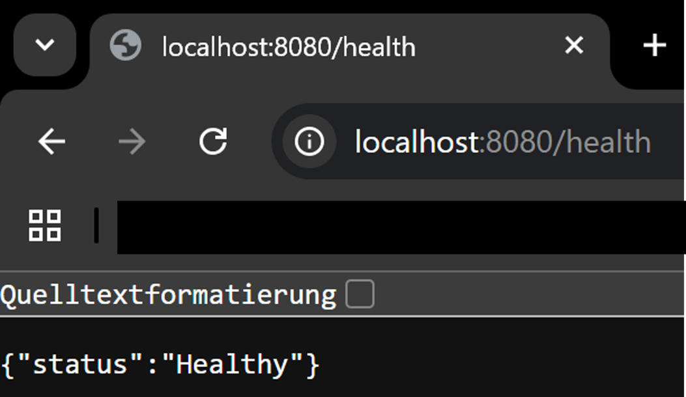

# GitHub Repository Link: 
https://github.com/AchiTsa/seip_assignment_1_2026.git

# CI/CD Proof: 

# Cluster State Proof: 
kubectl get all -n default:
 

kubectl get configmap,secret:

 
# Application Verification Proof:
http://localhost:8080/

 
http://localhost:8080/secure-config
 

http://localhost:8080/health
  

# AI Reflection & Future Outlook: 
AI Usage & Future Engineering Report

## AI Integration

In this assignment, Gemini was utilized as a coding assistant for pair programming. The AI assisted in:
- Assisting in generating the production-optimized Dockerfile
- Assisting in creating the GitHub Actions CI/CD workflow
- Assisting in codesigning the Kubernetes manifests with resource constraints and health probes.
- Reformulating and spell checking the technical documentation.

## Utility Analysis 

The AI assistance was most useful for:
- Syntax and Schema: Quickly providing correct Kubernetes manifest structures and GitHub Action syntax, which saved time on documentation lookups.
- Best Practices: Implementing 12-Factor App principles by decoupling configuration and secrets.
- Base64 Encoding: Ensuring the secret was correctly encoded for the Kubernetes manifest.

## Friction Points

- Environment Context: The AI does not have real-time access to the user's specific GitHub username or local Minikube environment state.
- Troubleshooting: Manual troubleshooting required for local network routing issues or Minikube-specific VM errors that are outside the scope of static code generation.

## Future Architectural Outlook

If this pipeline were to be scaled for a real-world enterprise system, the following steps would be taken:
1. Ingress Controller: Replace port-forwarding with an Ingress Controller and cert-manager for automated SSL/TLS termination.
2. GitOps Workflow: Implement a true GitOps workflow to ensure the cluster state always matches the repository.
3. Monitoring & Observability: Add Prometheus and Grafana for metrics collection and visualization and Loki for log aggregation.
4. Security Scanning: Integrate image scanning tools into the CI pipeline to detect vulnerabilities before pushing to GHCR.
5. Helm Charts: Package the Kubernetes manifests into a Helm Chart for better versioning and environment-specific configuration management.
